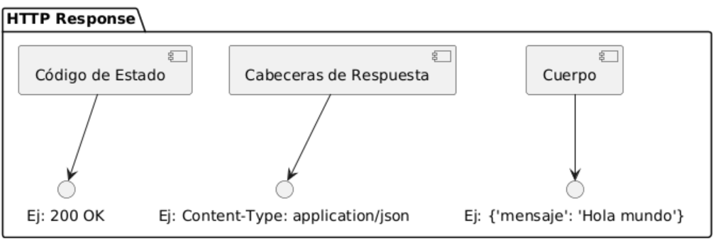
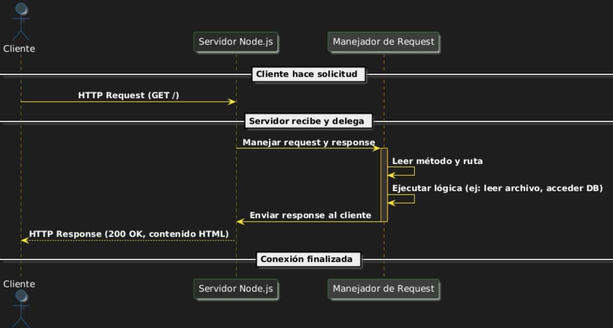

# Servidores node.js 

## Conceptos Preliminares 

## ¿Qué es Node.js?

Node.js es un entorno de ejecución para JavaScript construido sobre el motor V8 de Google Chrome. Permite ejecutar código JavaScript fuera del navegador, principalmente en el servidor.

### Características clave:
- Es **asíncrono y orientado a eventos**.
- Usa un **modelo de I/O no bloqueante**, lo que lo hace eficiente para aplicaciones que manejan múltiples conexiones simultáneamente (como servidores web).
- Es multiplataforma (funciona en Windows, macOS, Linux).
- Tiene un gestor de paquetes muy robusto: **npm (Node Package Manager)**.

### ¿Por qué usar Node.js?
- Permite usar JavaScript en el backend.
- Es ideal para aplicaciones en tiempo real, como chats, juegos en línea, APIs, etc.
- Posee una gran comunidad y librerías reutilizables.

---

## Módulos en node.js y su uso

### ¿Qué es un módulo?
Un módulo es simplemente un archivo de JavaScript que encapsula funcionalidad que puede ser reutilizada. En Node.js, cada archivo es tratado como un módulo independiente.

### ¿Para qué sirven?
- Para **organizar el código** en partes reutilizables y más manejables.
- Permiten **importar y exportar funciones, objetos o variables** entre archivos.

### Sintaxis básica para usar módulos
- `require`: se usa para importar módulos en Node.js.
- `module.exports`: se usa para exportar lo que queremos hacer público desde un archivo.

### 📦 Ejemplo 1: módulo propio (creado por el mismo desarrollador)

**Archivo: `operaciones.js`**
```javascript
function sumar(a, b) {
  return a + b;
}

function restar(a, b) {
  return a - b;
}

module.exports = {
  sumar,
  restar
};
```

**Archivo: `app.js`**
```javascript
const operaciones = require('./operaciones');

console.log("Suma:", operaciones.sumar(5, 3));   // Suma: 8
console.log("Resta:", operaciones.restar(5, 3)); // Resta: 2
```

### 📦 Ejemplo 2: importar solo una parte del módulo

```javascript
const { sumar } = require('./operaciones');
console.log(sumar(10, 7)); // 17
```

---

## Tipos de módulos en Node.js

Node.js permite trabajar con diferentes tipos de módulos:

1. **Módulos propios**
   - Creados por el desarrollador.
   - Son archivos `.js` que se exportan con `module.exports`.

2. **Módulos nativos (core modules)**
   - Vienen integrados en Node.js.
   - No necesitan instalación.
   - Ejemplos: `fs`, `http`, `path`, `os`, `events`.

```javascript
const os = require('os');
console.log("Sistema operativo:", os.platform());
```

3. **Módulos de terceros**
   - Se instalan mediante `npm`.
   - Ejemplos: `express`, `moment`, `dotenv`.

```bash
npm install moment
```

```javascript
const moment = require('moment');
console.log(moment().format('YYYY-MM-DD'));
```

---

## Protocolo HTTP 

### ¿Qué es HTTP?
HTTP es el protocolo que permite la comunicación entre un **cliente** (como un navegador web) y un **servidor**. Funciona mediante **peticiones (requests)** y **respuestas (responses)**.

### Componentes clave de una petición HTTP:
- **Método**: indica la intención (GET, POST, PUT, DELETE, etc.).
- **Ruta o URL**: especifica el recurso (ej: `/usuarios`).
- **Cabeceras (headers)**: contienen metadatos (ej: tipo de contenido).
- **Cuerpo (body)**: usado en métodos como POST o PUT para enviar datos.

### Componentes clave de una respuesta HTTP:
- **Código de estado**: indica el resultado (200 OK, 404 Not Found, 500 Error).
- **Cabeceras de respuesta**: indican el tipo de contenido devuelto, etc.
- **Cuerpo**: contiene los datos que devuelve el servidor (ej: HTML, JSON).

#### Esquema de una respuesta HTTP


### Importancia para Node.js:
- Node.js tiene un módulo nativo llamado `http` para crear servidores web que responden a peticiones HTTP.
- Es importante comprender cómo funciona una petición/respuesta para entender el manejo en el backend.

### Flujo HTTP:

