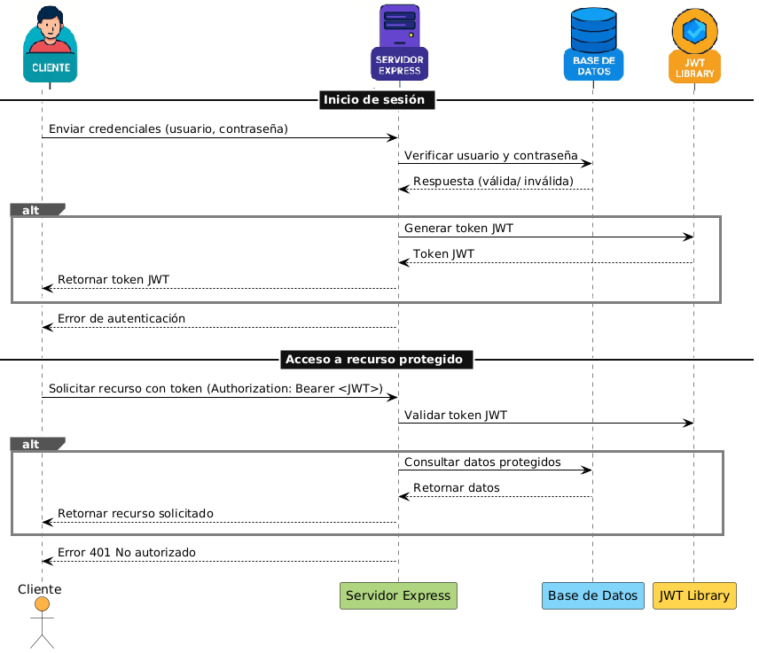

# JSON Web Token (JWT)

## ¿Qué es JWT?

JWT significa **JSON Web Token**, y es un estándar abierto que se utiliza principalmente para **autenticación** y **autorización** en aplicaciones web.

Un JWT es un **token en formato JSON**, que se codifica y se usa para transmitir información entre cliente y servidor de manera **segura** y **compacta**.

---

## ¿Para qué sirve JWT?

### 🔑 Autenticación
1. Un usuario inicia sesión con su usuario y contraseña.  
2. El backend valida las credenciales en la **base de datos**.  
3. Si son correctas, el servidor genera un **JWT**.  
4. El cliente (navegador o app) guarda ese token y lo envía en cada solicitud posterior para identificarse.  

### 🔒 Autorización
El servidor valida el **JWT** en cada petición:  
- Si el token es válido y no ha caducado → el usuario puede acceder al recurso.  
- Si el token no es válido → acceso denegado.  

---

## ¿Cómo se ve un JWT?

Un JWT tiene **tres partes**, separadas por puntos (`.`):

```
xxxxx.yyyyy.zzzzz
```

Ejemplo real:

- **Header (encabezado):**  
  `eyJhbGciOiJIUzI1NiIsInR5cCI6IkpXVCJ9`  

- **Payload (datos):**  
  `eyJzdWIiOiIxMjM0NTY3ODkwIiwibmFtZSI6...`  

- **Signature (firma):**  
  `SflKxwRJSMeKKF2QT4fwpMeJf36POk6yJV_adQ...`  

---

## ⚙️ Componentes de un JWT

- **Header (encabezado):** Define el tipo de token (`JWT`) y el algoritmo de firma (ejemplo: `HS256`).  
- **Payload (datos):** Contiene información (claims), como:  
  ```json
  {
    "usuario": "jose",
    "rol": "admin",
    "exp": 1736783200
  }
  ```
- **Signature (firma):** Es una huella digital única que asegura que el token no fue alterado.  

---

## ¿Qué significa "firmar un token"?

Firmar un token es como **poner un sello único** al contenido.  
El servidor combina el **header + payload** con una **clave secreta** y aplica un algoritmo criptográfico para generar la firma.  

Si alguien intenta modificar el token (ejemplo: cambiar `rol: "user"` a `rol: "admin"`), la firma ya no coincide y el token será rechazado.  

**Analogía sencilla:**  
- El payload es el mensaje en un papel.  
- El token es el sobre que guarda ese papel.  
- La firma es el **sello de cera** especial que solo el servidor conoce.  

Si el sello está intacto, confías en el mensaje. Si está roto, alguien lo manipuló.  

---

## Diagrama del proceso con JWT

En el siguiente gráfico se visualiza el flujo de cómo el **cliente, el servidor y la base de datos** interactúan usando JWT para autenticación y autorización:  



---

## Instalación rápida

```bash
npm init -y
npm install express jsonwebtoken nodemon
```

Para iniciar el servidor:  

```bash
npx nodemon index.js
```
