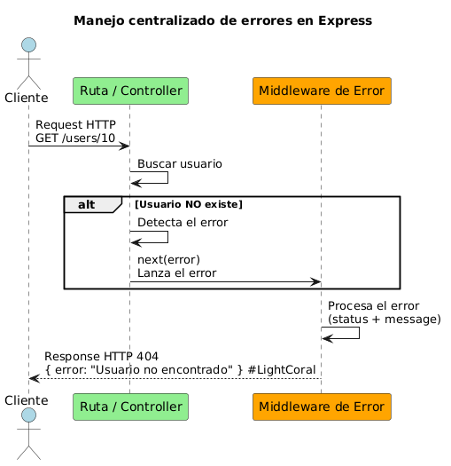
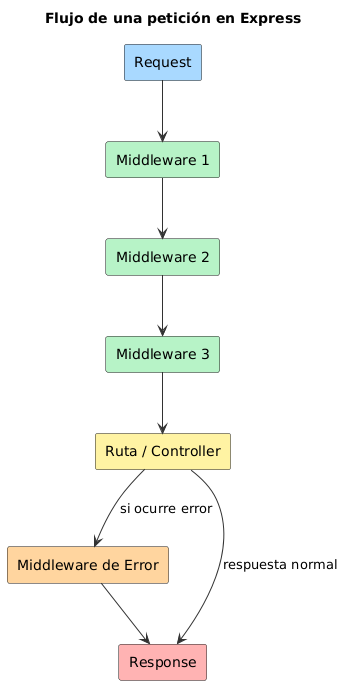

# Clase 7 --- Gestión de errores en Express

## 1. El problema: cuando algo sale mal en una API

Cuando un cliente consume una API, el servidor espera que todo funcione
correctamente:

Cliente → Request → Servidor → Response

Pero muchas cosas pueden salir mal:

-   Se solicita un recurso que no existe
-   Se envían datos inválidos
-   Hay un error en el código
-   Falla la base de datos

Si el servidor **no maneja estos errores**, la aplicación puede:

-   enviar respuestas incorrectas
-   dejar la petición sin respuesta
-   mostrar errores internos del sistema

A esto informalmente se le llama:

**"El servidor se rompe"**

Esto no siempre significa que el servidor se apague, sino que **la
ejecución del código falla y el servidor no responde correctamente**.

------------------------------------------------------------------------

# 2. Tipos de errores en una API

Las APIs utilizan **códigos HTTP** para comunicar qué ocurrió.

## Errores del cliente (4xx)

Ocurren cuando el problema está en la solicitud del cliente.

  Código   Cuándo usarlo
  -------------------------------------------------
  400 :     Cuando los datos enviados son inválidos
  401  :    Cuando el usuario no está autenticado
  403  :    Cuando el usuario no tiene permisos
  404  :   Cuando el recurso solicitado no existe

Ejemplo:

GET /users/10

Si el usuario no existe se responde:

404 Not Found

------------------------------------------------------------------------

## Errores del servidor (5xx)

Ocurren cuando el problema está en la aplicación.

  Código   Cuándo usarlo
  -------- --------------------------------------
  500 :     Error inesperado del servidor
  502 :    Error en otro servicio externo
  503 :    Servicio temporalmente no disponible

------------------------------------------------------------------------

# 3. Concepto: Middleware de error

Un middleware de error es una función especial que Express usa para
**capturar errores que ocurren en cualquier parte de la aplicación**.

Se distingue porque recibe **cuatro parámetros**:

``` javascript
(err, req, res, next)
```

Ejemplo:

``` javascript
app.use((err, req, res, next) => {

  res.status(500).json({
    error: "Error interno del servidor"
  });

});
```

Este middleware:

1.  recibe el error
2.  decide qué respuesta enviar
3.  evita que el servidor envíe errores descontrolados

------------------------------------------------------------------------

# 4. Enviar errores al middleware

Para enviar un error al middleware se utiliza:

``` javascript
next(error)
```

Ejemplo:

``` javascript
const error = new Error("Usuario no encontrado");
error.status = 404;

next(error);
```

Esto envía el error al middleware global de errores.

------------------------------------------------------------------------

# 5. La regla real que usan las APIs profesionales

En APIs grandes se suele aplicar esta regla:

**Las rutas NO envían respuestas de error directamente.**



Esto permite:

-   centralizar el manejo de errores
-   mantener consistencia en las respuestas
-   registrar errores fácilmente

------------------------------------------------------------------------

# Conceptos adicionales

## 1. Cómo funciona app.use() con múltiples middlewares

Cada vez que escribimos:

``` javascript
app.use(middleware)
```

estamos agregando una función al **pipeline de procesamiento de la petición**.

Flujo típico:


------------------------------------------------------------------------

## 2. Ejemplo con varios middlewares globales

``` javascript
const express = require("express");

const app = express();

app.use((req, res, next) => {
  console.log("Middleware 1");
  next();
});

app.use((req, res, next) => {
  console.log("Middleware 2");
  next();
});

app.use((req, res, next) => {
  console.log("Middleware 3");
  next();
});

app.get("/test", (req, res) => {
  res.json({ message: "ok" });
});

app.listen(3000);
```

------------------------------------------------------------------------

## 3. Probar el flujo

Ejecutar:

``` bash
node server.js
```

Luego hacer una solicitud:

``` bash
curl http://localhost:3000/test
```

Salida en consola:

Middleware 1\
Middleware 2\
Middleware 3

Esto demuestra que **los middlewares se ejecutan en orden**.

------------------------------------------------------------------------

## 4. Tipos de middlewares globales comunes

En aplicaciones reales normalmente hay varios:

``` javascript
app.use(express.json());          // parsear JSON
app.use(loggerMiddleware);        // logging
app.use(authMiddleware);          // autenticación
app.use(rateLimitMiddleware);     // limitar solicitudes
```

Luego se registran las rutas:

``` javascript
app.use("/users", userRoutes);
app.use("/products", productRoutes);
```

------------------------------------------------------------------------

## 5. Regla muy importante con el middleware de errores

El middleware de errores **debe ir al final**.

Ejemplo correcto:

``` javascript
app.use(loggerMiddleware);
app.use(express.json());

app.use("/users", userRoutes);

app.use(errorMiddleware);
```

Si se coloca antes, **no capturará los errores de las rutas**.

------------------------------------------------------------------------

## 6. También puedes aplicar middlewares a rutas específicas

Los middlewares también pueden aplicarse solo a ciertas rutas.

Ejemplo:

``` javascript
app.use("/admin", authMiddleware);
```

Esto significa que **todas las rutas que empiecen con `/admin` pasarán
primero por ese middleware**.
